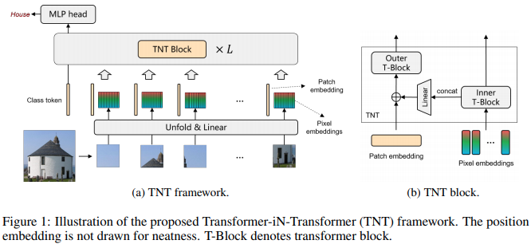

</img>

## Transformer in Transformer

Implementation of <a href="https://arxiv.org/abs/2103.00112">Transformer in Transformer</a>, pixel level attention paired with patch level attention for image classification, in Pytorch.

<a href="https://www.youtube.com/watch?v=HWna2c5VXDg">AI Coffee Break with Letita</a>

## Install

```bash
$ pip install transformer-in-transformer
```

## Usage

```python
import torch
from transformer_in_transformer import TNT

tnt = TNT(
    image_size = 256,       # size of image
    patch_dim = 512,        # dimension of patch token
    pixel_dim = 24,         # dimension of pixel token
    patch_size = 16,        # patch size
    pixel_size = 4,         # pixel size
    depth = 6,              # depth
    num_classes = 1000,     # output number of classes
    attn_dropout = 0.1,     # attention dropout
    ff_dropout = 0.1        # feedforward dropout
)

img = torch.randn(2, 3, 256, 256)
logits = tnt(img) # (2, 1000)
```

## Citations

```bibtex
@misc{han2021transformer,
    title   = {Transformer in Transformer}, 
    author  = {Kai Han and An Xiao and Enhua Wu and Jianyuan Guo and Chunjing Xu and Yunhe Wang},
    year    = {2021},
    eprint  = {2103.00112},
    archivePrefix = {arXiv},
    primaryClass = {cs.CV}
}
```
